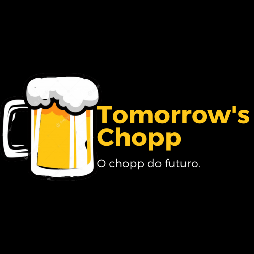
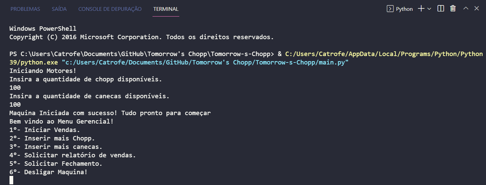

<!-- # Tomorrow's Chopp
 Tomorrow's chopp e o inicio de um software que ira controlar uma maquina de chopp. Nos arquivos encontraram uma planilha do excel explicando melhor o que sera feito e a função do software -->
# PDF-Generator

## Describe
 Tomorrow's chopp e o inicio de um software que ira controlar uma maquina de chopp. A ideia foi baseada após o diversos donos de bares precisarem passar o feriado trabalhando e não com sua familia.

Tomorrow's draft beer is the start of a software that will control a draft beer machine. The idea was based on several bar owners needing to spend the holiday working and not with their family.

## How to Use

### installing

Clone This Repository:

`git clone https://github.com/Catrofe/Tomorrow-s-Chopp.git`

Go to repository:
`cd Tomorrow-s-Chopp`

## Run

Open Your favorite terminal and run: `python main.py`

## Contributing

* We use [SemVer](http://semver.org/) for versioning. For the versions available, see the [tags on this repository](https://github.com/Catrofe/Tomorrow-s-Chopp/tags).

## Authors

* Christian Lima - Initial work

See also the list of [contributors](https://github.com/Catrofe/Tomorrow-s-Chopp/contributors) who participated in this project.

## Screenshot

